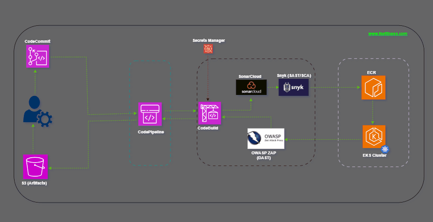

<h1 align="center">DevSecOps on AWS</h1>

Demonstrated with <a href="https://nodejs.org">NodeJS</a> App - <a href="https://ike-fitness.onrender.com">Ike Fitness</a>

---

  

---

# DevSecOps Pipeline Steps

- Push Code to AWS CodeCommit repository
- Code is checked out by AWS CodePipeline and sent to AWS CodeBuild
- AWS CodeBuild Downloads necessary secret variables from AWS Secrets Manager
- AWS CodeBuild installs the necessary packages and dependencies for the entire build project
- Code Quality Test is performed by [SonarCloud](https://www.sonarsource.com/products/sonarcloud/) and result saved in SonarCloud project
- The result is curled from SonarCloud project and check the _Quality Gates_. If Quality gate failed, pipeline exit
- Open Source or 3rd party libraries are tested for security vulnerabilities (SCA) with [Snyk](https://snyk.io/)
- If a vulnerability with CVSS Score >= 7 is discovered, pipeline exit
- Code is tested for vulnerability (SAST) with Snyk.
- If a vulnerability at level 'error' is discovered, pipeline exit
- Code is built with _npm build_
- Code is dockerized using the included _Dockerfile_
- Docker image is pushed to AWS ECR repository
- Image is pulled from AWS ECR repository and deployed on AWS EKS Cluster
- Load Balancer IP is extrated from the cluster using _kubectl_
- Using the load balancer, DAST testing is performed with [OWASP ZAP](https://www.zaproxy.org/)
- Artifact is collated and sent back to AWS CodePipeline
- AWS CodePipeline sends the Artifact to AWS S3 Bucket
- Exit 0

## Infrastructure Configuration

✅ AWS CodeCommit

- The Code repository
- If you connect to AWS with Single-Sign-On, you need to install [git-remote-codecommit](https://docs.aws.amazon.com/codecommit/latest/userguide/setting-up-git-remote-codecommit.html) to clone and push to CodeCommit repository

✅ AWS CodePipeline

- Manages the pipeline
- Checks out code from AWS CodeCommit repository, sends it to CodeBuild, and receives the artifact from CodeBuild to store in S3
- Must have write permission on specified bucket, and kms decrypt permission

✅ AWS Secrets Manager

- Stores the secrets variables used by both the Infrastructure (like CodeBuild), the pipeline, and the NodeJS application

✅ AWS CodeBuild

- Uses node:20 runtime running on Ubuntu 22.04
- Must have decrypt permission on kms
- Must have necessary permissions on specified secret manager secret, S3 bucket, ECR repo, EKS cluster and nodes
- Deployed with environment variable configurations having tokens to access SonarCloud and Snyk

✅ AWS ECR Repositary

- Container repository for docker images

✅ AWS EKS Cluster

- The Kubernetes control plain used to deploy the application
- Configured to deploy the app on 2 loadbalanced nodes running on private subnets in 2 availability zones
- The CodeBuild IAM role must be added to the [aws-auth configMap](https://docs.aws.amazon.com/eks/latest/userguide/add-user-role.html), with group - system:masters

✅ AWS S3 Bucket

- Used to hold the artifacts

✅ AWS IAM

- Manages the roles and their permissions

## The NodeJS Application ([Ike Fitness](https://ike-fitness.onrender.com))

- The application is reconfigured to read secret envs from AWS Secret Manager
- To set it up, the AWS Region hosting the secrets needs to be specified at the entry point of the app ([server.js](ike-code/server.js))
